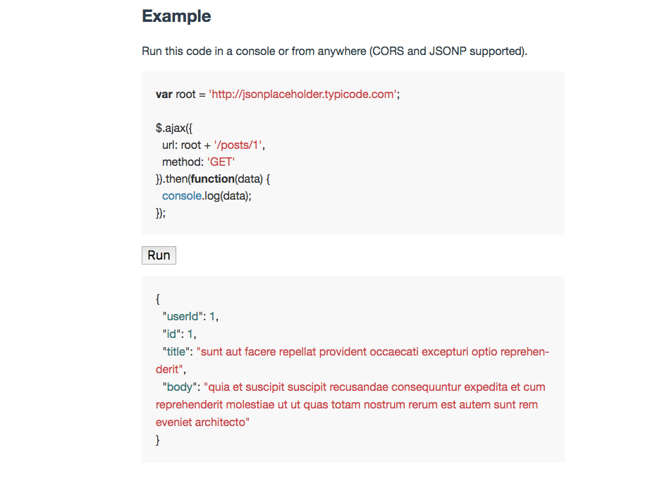

title: BeerJS Theme
author:
  name: Jorge Epuñan H.
  twitter: beerjssantiago
  url: http://www.beerjs.cl
output: index.html
theme: juanbrujo/cleaver-beerjs

--

# Simple API con JSON Server

## BeerJS Santiago - Agosto 2017

--

### JSON Server: 

Get a full fake REST API with zero coding in less than 30 seconds

Quién lo usa: [JSONPlaceholder](http://jsonplaceholder.typicode.com/)

--



--

### Uso:

db.json:

```javascript
{
  "candidatos": [
    {
      "candidato": {
        "nombre": "Alberto Mayol",
        "foto": "https://pbs.twimg.com/profile_images/849674213740785664/DxVcm4S4.jpg",
        "url": "",
        "twitter": "https://twitter.com/MayolPresidente",
        "facebook": ""
      },
      "partido": {
        "nombre": "Frente Amplio",
        "logo": "https://upload.wikimedia.org/wikipedia/commons/3/37/Frente_Amplio_Chile_2017.png"
      },
      ...
```

--

### Uso:

server.json:

```javascript
const jsonServer = require('json-server');
const server = jsonServer.create();
const router = jsonServer.router('db.json');
const middlewares = jsonServer.defaults();
const port = process.env.PORT || 3000

server.use(middlewares);
server.use(router);
server.use(jsonServer.bodyParser);

server.use((req, res, next) => {
  if (req.method === 'POST') {
    req.body.createdAt = Date.now();
  }
  next();
})

server.listen(port, () => {
  console.log('JSON Server is running # localhost:' + port);
});
```

--

### Simples Ejemplos:

[bomberos-cl-api](https://bomberos-cl-api.herokuapp.com/) | [repositorio](https://github.com/juanbrujo/beerjs-bomberos-moon/) | [demo](http://frame-maker-tendencies-25300.netlify.com/)

[feriados-cl-api](https://feriados-cl-api.herokuapp.com/) | [repositorio](https://github.com/juanbrujo/Feriados-Chile-VueJS) | [demo](https://juanbrujo.github.io/Feriados-Chile-VueJS/index.html)

[presidenciables-chile-2017-api](https://presidenciables-chile-2017-api.herokuapp.com/) | [repositorio](https://github.com/juanbrujo/presidenciables-api) | [demo](https://juanbrujo.github.io/presidenciables-chile2017-moonjs/index.html)

--

### Aporta:

[Listado de API’s Públicas en Chile](http://juanbrujo.github.io/listado-apis-publicas-en-chile/)
